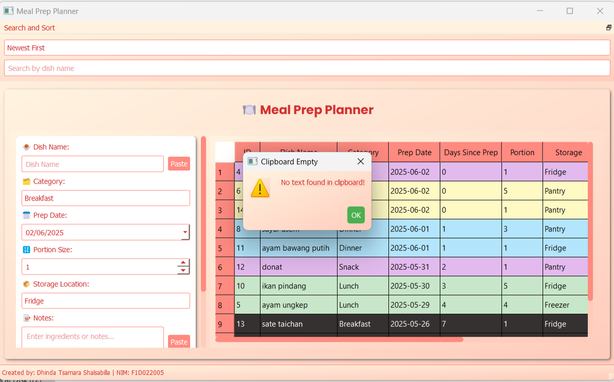
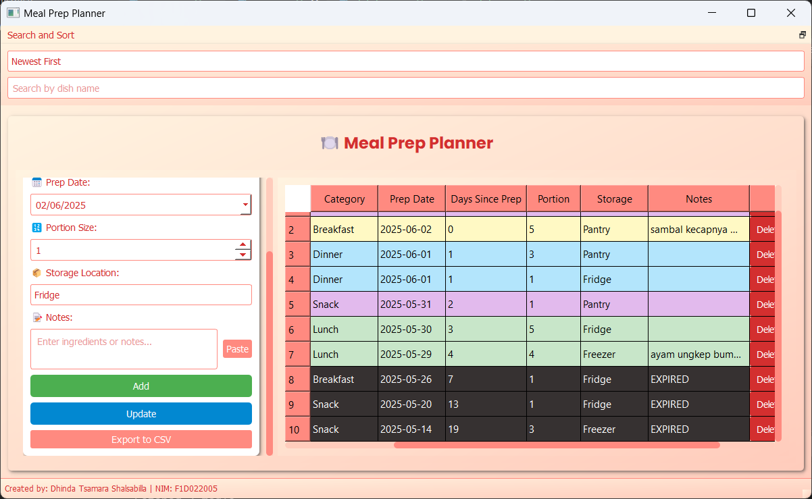

# 🍽️ Meal Prep Planner

**Meal Prep Planner** adalah aplikasi desktop berbasis **PyQt5** yang dirancang untuk membantu pengguna dalam mengelola rencana persiapan makanan secara efisien.

Aplikasi ini menyediakan fitur CRUD (Create, Read, Update, Delete) data makanan, dengan tampilan dua panel:
- **Kiri:** Form input untuk menambah dan mengedit data
- **Kanan:** Tabel data makanan yang dapat disortir, dicari, dan diekspor

### Fitur Utama
- **Manajemen Data Makanan**: Tambah, edit, hapus, dan lihat data makanan dengan operasi CRUD.
- **Kategorisasi Makanan**: Kelompokkan makanan ke dalam kategori (Breakfast, Lunch, Dinner, Snack) dengan warna berbeda di tabel.
- **Penyortiran dan Pencarian**: Urutkan data berdasarkan tanggal persiapan (Newest First/Oldest First) dan cari berdasarkan nama hidangan.
- **Penanda Kadaluarsa**: Tandai makanan yang lebih dari 5 hari sejak tanggal persiapan dengan warna hitam dan catatan "EXPIRED".
- **Ekspor Data**: Simpan data ke file CSV untuk analisis atau pencatatan.
- **Clipboard Support**: Paste teks dari clipboard ke field Dish Name dan Notes.
- **Docked Widget**: Widget pencarian dan penyortiran yang dapat dipindah (atas, bawah, atau mengambang).
- **Status Bar**: Tampilkan identitas pembuat aplikasi di bagian bawah.
- **Scroll Area**: Dukungan scroll horizontal dan vertikal untuk formulir dan tabel.

---

## Mekanisme CRUD

### 1. Create (Tambah Data)
  
Pengguna dapat menambahkan data dengan mengisi form di sebelah kiri. Field yang wajib diisi:
- Dish Name
- Category
- Prep Date
- Storage Location

Field *Notes* bersifat opsional. Setelah semua terisi, klik tombol **Add** untuk menyimpan data.

---

### 2. Retrieve (Lihat Data)
  
Data yang telah dimasukkan akan ditampilkan di tabel sebelah kanan.  
Pengguna juga dapat menggunakan fitur:
- **Search** (berdasarkan nama hidangan)
- **Sort** (berdasarkan tanggal (newest/oldest))

---

### 3. Update (Edit Data)
  
Untuk mengedit data:
- Klik sekali pada data di tabel
- Form input di kiri akan terisi otomatis
- Lakukan perubahan, lalu klik tombol **Update**

Untuk membatalkan proses edit, klik sekali lagi pada data di tabel.

---

### 4. Delete (Hapus Data)
  
Untuk menghapus data:
- Scroll tabel ke kanan
- Klik tombol **Delete** pada baris data yang diinginkan
- Akan muncul kotak dialog konfirmasi sebelum data dihapus

---

## Tampilan Aplikasi & Fitur Tambahan

### 1. Tampilan Awal

  
Tampilan saat aplikasi dibuka dan dalam mode layar penuh.

---

### 2. Clipboard Integration
  
Pengguna dapat menempel (paste) teks dari clipboard untuk mengisi `Dish Name` dan `Notes`.

  
Peringatan akan muncul jika clipboard kosong.

---

### 3. Docked Widget
  
Docked widget (Search & Sort) secara default berada di bagian atas, tetapi dapat dipindahkan ke lokasi lain:
- Tengah
- Bawah

---

### 4. Status Bar
  
Menampilkan identitas pembuat aplikasi di kiri bawah.

---

### 5. Scroll Area
  
Form input dan tabel mendukung scroll horizontal dan vertikal, berguna saat layar tidak penuh atau tampilan terpotong.

---

## Catatan
Fitur-fitur dasar lainnya telah dijelaskan dalam `README.md` sebelumnya pada `pv25_week10`.  
Dokumen ini merupakan pembaruan dan dokumentasi tambahan dari fitur-fitur terbaru yang telah ditambahkan ke aplikasi Meal Prep Planner.

---

## Developer
Dikembangkan menggunakan Python & PyQt5.